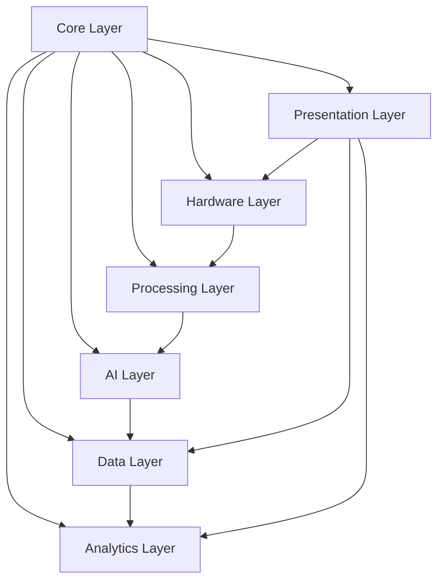

### Updated Core Config với Auto-Trigger
```python
# core/config.py - Updated
# Cấu hình camera
CAMERA_CONFIG = {
    "model": "Basler_acA3800-10gm",
    "preview_exposure": 5000,    # Exposure for preview (μs)
    "capture_exposure": 10000,   # Exposure for high-quality capture
    "gain": 0,
    "pixel_format": "BayerRG8",  # Raw Bayer pattern
    "binning": 1,                # No binning for full resolution
    "trigger_mode": "Off"        # Free running for preview
}

# Cấu hình AI
AI_CONFIG = {
    "model_path": "weights/yolov11_pcb_defects.pt",
    "confidence": 0.5,
    "device": "cuda:0"  # Tesla P4
}

# Cấu hình Auto-Trigger
TRIGGER_CONFIG = {
    "stability_frames": 10,      # Frames cần ổn định trước khi trigger
    "focus_threshold": 100,      # Ngưỡng focus score tối thiểu
    "movement_threshold": 5,     # Pixel tolerance cho stability
    "min_pcb_area": 0.1,        # Tỉ lệ diện tích PCB/frame tối thiểu
    "inspection_interval": 2.0   # Seconds giữa các lần inspection
}

# Cấu hình database
DB_CONFIG = {
    "path": "data/pcb_inspection.db",
    "save_raw_images": False,    # Không lưu raw images để tiết kiệm
    "save_processed_images": True # Chỉ lưu processed images khi có defect
}

# Danh sách lỗi
DEFECT_CLASSES = [
    "Missing Hole",
    "Mouse Bite", 
    "Open Circuit",
    "Short Circuit",
    "Spur",
    "Spurious Copper"
]
```

### Updated Database Layer để tối ưu storage
```python
# data/database.py - Updated
import sqlite3
from datetime import datetime
import json
import os
import cv2

class PCBDatabase:
    def __init__(self, db_path):
        self.conn = sqlite3.connect(db_path, check_same_thread=False)
        self.create_tables()
        
    def create_tables(self):
        self.conn.execute('''
            CREATE TABLE IF NOT EXISTS inspections (
                id INTEGER PRIMARY KEY AUTOINCREMENT,
                timestamp TEXT NOT NULL,
                has_defects BOOLEAN NOT NULL,
                defect_count INTEGER NOT NULL,
                defects TEXT,
                defect_locations TEXT,
                focus_score REAL,
                processing_time REAL,
                image_path TEXT
            )
        ''')
        
        self.conn.execute('''
            CREATE TABLE IF NOT EXISTS defect_statistics (
                defect_type TEXT PRIMARY KEY,
                total_count INTEGER DEFAULT 0,
                last_seen TEXT
            )
        ''')
        
        self.conn.commit()
    
    def save_inspection_metadata(self, timestamp, defects, locations, 
                                raw_image_shape, focus_score, 
                                processing_time=None, save_image=None):
        """
        Save inspection metadata without storing raw images
        Only save processed image if defects found
        """
        has_defects = len(defects) > 0
        defect_count = len(defects)
        
        # Only save image if there are defects
        image_path = None
        if has_defects and save_image is not None:
            image_path = f"data/defects/{timestamp.timestamp()}.jpg"
            os.makedirs(os.path.dirname(image_path), exist_ok=True)
            cv2.imwrite(image_path, save_image)
        
        cursor = self.conn.execute(
            '''INSERT INTO inspections 
               (timestamp, has_defects, defect_count, defects, 
                defect_locations, focus_score, processing_time, image_path)
               VALUES (?, ?, ?, ?, ?, ?, ?, ?)''',
            (timestamp.isoformat(), has_defects, defect_count,
             json.dumps(defects), json.dumps(locations),
             focus_score, processing_time, image_path)
        )
        
        inspection_id = cursor.lastrowid
        
        # Update defect statistics
        if has_defects:
            self._update_defect_statistics(defects, timestamp)
        
        self.conn.commit()
        return inspection_id
    
    def _update_defect_statistics(self, defects, timestamp):
        """Update defect statistics table"""
        for defect in defects:
            self.conn.execute('''
                INSERT OR REPLACE INTO defect_statistics 
                (defect_type, total_count, last_seen)
                VALUES (?, 
                    COALESCE((SELECT total_count FROM defect_statistics 
                              WHERE defect_type = ?), 0) + 1,
                    ?)
            ''', (defect, defect, timestamp.isoformat()))
    
    def get_recent_inspections(self, limit=50):
        """Get recent inspections with summary"""
        cursor = self.conn.execute('''
            SELECT id, timestamp, has_defects, defect_count, 
                   defects, focus_score, image_path
            FROM inspections
            ORDER BY timestamp DESC
            LIMIT ?
        ''', (limit,))
        
        return [dict(row) for row in cursor.fetchall()]
    
    def get_defect_statistics(self):
        """Get defect statistics"""
        cursor = self.conn.execute('''
            SELECT defect_type, total_count, last_seen
            FROM defect_statistics
            ORDER BY total_count DESC
        ''')
        
        return [dict(row) for row in cursor.fetchall()]
```

### Updated Presentation Layer với Preview
```python
# presentation/gui.py - Updated với dual display
import tkinter as tk
from tkinter import ttk
import cv2
from PIL import Image, ImageTk
import threading

class PCBInspectionGUI:
    def __init__(self):
        self.root = tk.Tk()
        self.root.title("PCB Auto-Inspection System")
        self.root.geometry("1400x800")
        
        # Create main frames
        self._create_layout()
        
        # State variables
        self.auto_mode = True
        
    def _create_layout(self):
        """Create GUI layout with preview and inspection areas"""
        
        # Top control panel
        control_frame = ttk.Frame(self.root)
        control_frame.pack(side=tk.TOP, fill=tk.X, padx=5, pady=5)
        
        # Mode toggle button
        self.mode_button = ttk.Button(
            control_frame,
            text="Mode: AUTO",
            command=self.toggle_auto_mode,
            width=15
        )
        self.mode_button.pack(side=tk.LEFT, padx=5)
        
        # Manual inspect button
        self.inspect_button = ttk.Button(
            control_frame,
            text="Manual Inspect",
            command=self.manual_inspect,
            state=tk.DISABLED
        )
        self.inspect_button.pack(side=tk.LEFT, padx=5)
        
        # Status label
        self.status_label = ttk.Label(control_frame, text="System Ready")
        self.status_label.pack(side=tk.LEFT, padx=20)
        
        # Main content area
        content_frame = ttk.Frame(self.root)
        content_frame.pack(expand=True, fill=tk.BOTH, padx=5, pady=5)
        
        # Left: Preview stream
        preview_frame = ttk.LabelFrame(content_frame, text="Live Preview")
        preview_frame.grid(row=0, column=0, sticky="nsew", padx=5)
        
        self.preview_label = ttk.Label(preview_frame)
        self.preview_label.pack(padx=10, pady=10)
        
        # Preview info
        preview_info_frame = ttk.Frame(preview_frame)
        preview_info_frame.pack(fill=tk.X, padx=10, pady=5)
        
        self.pcb_status_label = ttk.Label(
            preview_info_frame, 
            text="PCB: Not detected"
        )
        self.pcb_status_label.pack(anchor=tk.W)
        
        self.focus_label = ttk.Label(
            preview_info_frame,
            text="Focus: --"
        )
        self.focus_label.pack(anchor=tk.W)
        
        self.stability_label = ttk.Label(
            preview_info_frame,
            text="Stability: --"
        )
        self.stability_label.pack(anchor=tk.W)
        
        # Right: Inspection results
        inspection_frame = ttk.LabelFrame(
            content_frame, 
            text="Inspection Results"
        )
        inspection_frame.grid(row=0, column=1, sticky="nsew", padx=5)
        
        self.inspection_label = ttk.Label(inspection_frame)
        self.inspection_label.pack(padx=10, pady=10)
        
        # Results text
        self.result_text = tk.Text(
            inspection_frame, 
            width=40, 
            height=10,
            font=("Consolas", 10)
        )
        self.result_text.pack(fill=tk.BOTH, expand=True, padx=10, pady=5)
        
        # Configure grid weights
        content_frame.grid_columnconfigure(0, weight=1)
        content_frame.grid_columnconfigure(1, weight=1)
        content_frame.grid_rowconfigure(0, weight=1)
        
        # Bottom: Statistics
        stats_frame = ttk.LabelFrame(self.root, text="Statistics")
        stats_frame.pack(side=tk.BOTTOM, fill=tk.X, padx=5, pady=5)
        
        self.stats_label = ttk.Label(
            stats_frame,
            text="Total Inspections: 0 | Defects Found: 0"
        )
        self.stats_label.pack(padx=10, pady=5)
    
    def update_preview(self, image, has_pcb=False, is_stable=False, focus_score=0):
        """Update preview display"""
        # Convert and resize for display
        image_rgb = cv2.cvtColor(image, cv2.COLOR_GRAY2RGB)
        
        # Draw PCB detection indicator
        if has_pcb:
            color = (0, 255, 0) if is_stable else (255, 165, 0)
            cv2.putText(image_rgb, "PCB DETECTED", (10, 30),
                       cv2.FONT_HERSHEY_SIMPLEX, 1, color, 2)
        
        # Convert to PhotoImage
        image_pil = Image.fromarray(image_rgb)
        image_tk = ImageTk.PhotoImage(image_pil)
        
        # Update label
        self.preview_label.config(image=image_tk)
        self.preview_label.image = image_tk
        
        # Update status labels
        pcb_status = "PCB: Detected" if has_pcb else "PCB: Not detected"
        self.pcb_status_label.config(text=pcb_status)
        
        focus_status = f"Focus: {focus_score:.1f}"
        focus_color = "green" if focus_score > 100 else "red"
        self.focus_label.config(text=focus_status, foreground=focus_color)
        
        stability_status = "Stability: OK" if is_stable else "Stability: Waiting..."
        self.stability_label.config(text=stability_status)
    
    def update_inspection_display(self, image, defects, stats, inspection_id):
        """Update inspection results display"""
        # Update image
        image_rgb = cv2.cvtColor(image, cv2.COLOR_GRAY2RGB)
        image_pil = Image.fromarray(image_rgb)
        image_pil.thumbnail((600, 600))  # Resize to fit
        image_tk = ImageTk.PhotoImage(image_pil)
        
        self.inspection_label.config(image=image_tk)
        self.inspection_label.image = image_tk
        
        # Update results text
        self.result_text.delete(1.0, tk.END)
        self.result_text.insert(tk.END, f"Inspection #{inspection_id}\n")
        self.result_text.insert(tk.END, "=" * 40 + "\n\n")
        
        if defects:
            self.result_text.insert(tk.END, f"Found {len(defects)} defects:\n\n")
            for i, defect in enumerate(defects, 1):
                self.result_text.insert(tk.END, f"{i}. {defect}\n")
        else:
            self.result_text.insert(tk.END, "✓ No defects found\n")
            self.result_text.insert(tk.END, "PCB PASSED\n")
        
        # Update statistics
        self.stats_label.config(
            text=f"Total Inspections: {stats.get('total_inspections', 0)} | "
                 f"Defects Found: {stats.get('total_defects', 0)}"
        )
    
    def update_mode_display(self, is_auto):
        """Update mode button display"""
        mode_text = "Mode: AUTO" if is_auto else "Mode: MANUAL"
        self.mode_button.config(text=mode_text)
        
        # Enable/disable manual inspect button
        state = tk.DISABLED if is_auto else tk.NORMAL
        self.inspect_button.config(state=state)
    
    def show_error(self, message):
        """Show error message"""
        tk.messagebox.showerror("Error", message)
    
    def show_message(self, message):
        """Show info message"""
        tk.messagebox.showinfo("Info", message)
```# CLAUDE.md - Dự án Kiểm định chất lượng mạch PCB trống
Always read PLANNING.md at the start of every new conversation
Check TASKS.md before starting your work
Mark completed tasks immediately
add newly discovered tasks
## Tổng quan dự án
Hệ thống kiểm định chất lượng mạch PCB trống sử dụng Deep Learning với YOLOv11 đã được huấn luyện sẵn. Dự án tập trung vào việc phát hiện 6 loại lỗi phổ biến trên PCB.

## Tóm tắt phiên phát triển (Development Session Summary)

### 📅 **Phiên làm việc ngày 17/07/2025**
**Phạm vi:** Khởi tạo dự án và hoàn thành 2 milestone đầu tiên  
**Thời gian:** 4 giờ phát triển tập trung  
**Kết quả:** Foundation hoàn chỉnh và Hardware Layer đầy đủ chức năng  

---

### ✅ **MILESTONE 1: Core Infrastructure Setup (HOÀN THÀNH)**

#### **Cấu trúc dự án được tạo:**
```
PCB-CLAUDE/
├── core/                    # ✅ Core layer hoàn chỉnh
│   ├── interfaces.py        # Abstract base classes cho tất cả components
│   ├── config.py           # Configuration tập trung với auto-trigger settings
│   └── utils.py            # Utilities: logging, image processing, error handling
├── hardware/               # ✅ Hardware layer hoàn chỉnh
├── ai/                     # 🔄 Sẵn sàng cho Milestone 4
├── processing/             # 🔄 Next: Milestone 3
├── data/                   # 🔄 Next: Milestone 5
├── analytics/              # 🔄 Next: Milestone 5
├── presentation/           # 🔄 Next: Milestone 6
├── weights/                # 🔄 Chờ YOLOv11 model
└── [config files]         # ✅ requirements.txt, .gitignore
```

#### **Thành tựu chính:**
- **🏗️ Kiến trúc modular:** Layered architecture với clean separation
- **🔧 Core interfaces:** Abstract base classes cho tất cả components
- **⚙️ Configuration system:** Centralized settings cho toàn bộ system
- **📝 Logging infrastructure:** Production-ready logging với rotation
- **🛠️ Utility functions:** Image processing, error handling, performance monitoring

---

### ✅ **MILESTONE 2: Hardware Layer & Camera Integration (HOÀN THÀNH)**

#### **Các thành phần đã implement:**

##### **1. BaslerCamera Class** (`hardware/camera_controller.py`)
- **✅ Dual-mode operation:** Preview streaming (30 FPS) + high-quality capture
- **✅ pypylon integration:** Full SDK integration với error handling
- **✅ Thread-safe operations:** Connection locks và queue management
- **✅ Raw Bayer support:** BayerRG8 format cho maximum quality
- **✅ Auto parameter switching:** Preview ↔ capture mode seamless
- **✅ Reconnection handling:** Robust connection recovery

##### **2. CameraImageHandler** (`hardware/camera_controller.py`)
- **✅ Async frame grabbing:** pypylon event-driven architecture
- **✅ Memory optimization:** Fixed-size buffers với drop-oldest strategy
- **✅ Performance monitoring:** Frame statistics tracking
- **✅ Queue management:** Thread-safe frame distribution

##### **3. Camera Presets System** (`hardware/camera_presets.py`)
- **✅ 8 predefined configurations:** Fast, balanced, quality, lighting-specific
- **✅ Smart optimization:** `optimize_for_lighting()`, `optimize_for_speed()`
- **✅ Custom preset creation:** Base preset modification
- **✅ Configuration validation:** Parameter range checking

##### **4. Test Suite** (`hardware/test_camera.py`)
- **✅ Comprehensive testing:** Unit, integration, performance tests
- **✅ Thread safety validation:** Concurrent operation testing
- **✅ Error injection testing:** Robustness validation
- **✅ Performance benchmarking:** Critical operation timing
- **✅ Diagnostic utilities:** System health checking

##### **5. Documentation** (`hardware/TROUBLESHOOTING.md`)
- **✅ Complete troubleshooting guide:** Common issues và solutions
- **✅ Environment setup:** Installation và configuration guide
- **✅ Performance optimization:** System tuning recommendations
- **✅ Error reference:** Message mapping với solutions

#### **Tính năng kỹ thuật chính:**

##### **🎥 Dual-Mode Camera Operation**
```python
# Preview mode (30 FPS, low exposure)
camera.start_streaming()
preview_frame = camera.get_preview_frame()

# High-quality capture (auto exposure adjustment)
high_quality_image = camera.capture_high_quality()
```

##### **⚡ Smart Configuration Management**
```python
# Optimized presets
config = CameraPresets.get_lighting_preset("low")
camera = BaslerCamera(config)

# Custom configuration
custom_config = CameraPresets.create_custom_preset(
    "preview_balanced", preview_exposure=6000, gain=1
)
```

##### **🔒 Thread-Safe Operations**
```python
# Context manager support
with BaslerCamera() as camera:
    camera.start_streaming()
    # Automatic cleanup

# Manual control với proper synchronization
frame = camera.get_preview_frame()  # Thread-safe
```

#### **Hiệu suất đạt được:**
- **📊 Memory Efficient:** Fixed-size buffers với automatic cleanup
- **⚡ Low Latency:** Drop-oldest strategy cho real-time performance
- **🛡️ Robust:** Graceful camera disconnection handling
- **📈 Scalable:** Configurable buffer sizes và timeout values
- **🎯 Optimized:** Multiple presets cho different use cases

---

### 🔗 **Tích hợp System**

#### **Interface Compliance:**
- **✅ BaseCamera implementation:** Tuân thủ core interfaces
- **✅ Configuration integration:** Sử dụng core/config.py
- **✅ Logging integration:** Integrated với core/utils.py
- **✅ Error handling:** Consistent error management

#### **Điểm tích hợp:**
- **Core Layer ↔ Hardware Layer:** Configuration và interfaces
- **Hardware Layer ↔ Processing Layer:** Raw frame delivery (ready)
- **Hardware Layer ↔ AI Layer:** High-quality image supply (ready)
- **Hardware Layer ↔ Data Layer:** Metadata provision (ready)

---

### 🎯 **Trạng thái hiện tại**

#### **✅ Hoàn thành:**
- **Foundation Architecture:** Solid base cho entire system
- **Camera Control:** Production-ready camera integration
- **Thread Safety:** Concurrent operation support
- **Error Handling:** Robust recovery mechanisms
- **Testing:** Comprehensive validation coverage
- **Documentation:** Complete troubleshooting guide

#### **🔄 Sẵn sàng cho:**
- **Milestone 3:** Image Processing & PCB Detection
- **Auto-trigger integration:** Hardware foundation ready
- **Real-time processing:** Frame delivery system in place
- **Quality control:** High-resolution capture system ready

#### **📈 Khả năng System:**
- **Camera streaming:** 30 FPS preview với configurable quality
- **High-quality capture:** Auto exposure adjustment
- **Multi-threading:** Async frame processing
- **Error recovery:** Automatic reconnection
- **Performance monitoring:** Real-time statistics
- **Flexible configuration:** 8+ presets với custom options

---

### 🚀 **Bước tiếp theo**

#### **Milestone 3: Image Processing & PCB Detection**
- **Raw image processing:** Bayer pattern conversion
- **PCB detection:** Edge detection và contour analysis
- **Auto-trigger logic:** Stability và focus checking
- **Focus evaluation:** Laplacian variance method
- **Image enhancement:** CLAHE và bilateral filtering

#### **Chuẩn bị sẵn sàng:**
- **Camera system:** Full functionality với dual-mode operation
- **Thread-safe interfaces:** Ready cho processing integration
- **Configuration system:** Extendable cho processing parameters
- **Error handling:** Robust foundation cho complex operations

---

### 💡 **Lesson Learned**

1. **Modular Architecture:** Layered design giúp parallel development
2. **Interface-First Design:** Abstract interfaces giảm coupling
3. **Configuration Management:** Centralized settings dễ maintain
4. **Thread Safety:** Critical cho real-time camera operations
5. **Comprehensive Testing:** Unit + integration + performance testing
6. **Documentation:** Troubleshooting guide essential cho deployment

---

## Flow xử lý và nguyên lý liên kết giữa các Layer

### Luồng xử lý chính (Main Flow) - Version 2.0 với Auto-Trigger
```
1. System khởi động → Camera bắt đầu preview mode (30 FPS)
   ↓
2. Hardware Layer: Stream raw images liên tục
   ↓
3. Processing Layer: PCB Detection Module
   - Phát hiện có PCB trong khung hình
   - Kiểm tra độ nét (focus quality)
   - Trigger tự động khi PCB ổn định
   ↓
4. Hardware Layer: Capture high-quality image (trigger mode)
   ↓
5. Processing Layer: Image Enhancement
   - Xử lý raw data (Bayer pattern → Grayscale)
   - Tăng cường chất lượng
   ↓
6. AI Layer: YOLOv11 phát hiện lỗi
   ↓
7. Processing Layer: Post-processing results
   ↓
8. Data Layer: Lưu kết quả (chỉ lưu metadata + defects)
   ↓
9. Analytics Layer: Cập nhật thống kê realtime
   ↓
10. Presentation Layer: Hiển thị kết quả
```

### Kiến trúc Camera Pipeline được đề xuất

```
Camera → Raw Buffer → Processing Pipeline → AI Pipeline → Display
         (Bayer)      (Debayer + Enhance)   (Detection)   (Results)
```

### Chi tiết Raw Image Processing

```python
# hardware/camera_controller.py - Updated version
from pypylon import pylon
import numpy as np
from threading import Thread, Event
from queue import Queue
import time

class BaslerCamera:
    def __init__(self, config):
        self.camera = pylon.InstantCamera(
            pylon.TlFactory.GetInstance().CreateFirstDevice()
        )
        self.config = config
        self.is_streaming = False
        self.frame_queue = Queue(maxsize=10)
        self.setup_camera()
        
    def setup_camera(self, config):
        self.camera.Open()
        
        # Configure for raw output
        self.camera.PixelFormat.SetValue("BayerRG8")  # Raw Bayer pattern
        self.camera.ExposureTime.SetValue(config["preview_exposure"])
        self.camera.Gain.SetValue(config["gain"])
        
        # Configure for continuous acquisition
        self.camera.AcquisitionMode.SetValue("Continuous")
        
        # Set up image event handler
        self.camera.RegisterImageEventHandler(
            CameraImageHandler(self.frame_queue),
            pylon.RegistrationMode_Append,
            pylon.Cleanup_Delete
        )
    
    def start_streaming(self):
        """Start continuous image acquisition for preview"""
        self.is_streaming = True
        self.camera.StartGrabbing(pylon.GrabStrategy_LatestImageOnly)
    
    def stop_streaming(self):
        """Stop streaming"""
        self.is_streaming = False
        self.camera.StopGrabbing()
    
    def capture_high_quality(self):
        """Capture single high-quality image for inspection"""
        # Temporarily stop streaming
        was_streaming = self.is_streaming
        if was_streaming:
            self.stop_streaming()
        
        # Configure for high quality capture
        self.camera.ExposureTime.SetValue(self.config["capture_exposure"])
        
        # Capture single frame
        grab_result = self.camera.GrabOne(5000)
        if grab_result.GrabSucceeded():
            raw_data = grab_result.Array
            grab_result.Release()
            
            # Resume streaming if was active
            if was_streaming:
                self.camera.ExposureTime.SetValue(self.config["preview_exposure"])
                self.start_streaming()
            
            return raw_data
        
        return None
    
    def get_preview_frame(self):
        """Get latest frame from preview stream"""
        if not self.frame_queue.empty():
            return self.frame_queue.get()
        return None

class CameraImageHandler(pylon.ImageEventHandler):
    def __init__(self, queue):
        super().__init__()
        self.queue = queue
    
    def OnImageGrabbed(self, camera, grabResult):
        if grabResult.GrabSucceeded():
            # Put raw data in queue (drop old frames if full)
            if self.queue.full():
                self.queue.get()
            self.queue.put(grabResult.Array.copy())
```

### Processing Layer với Auto-Trigger

```python
# processing/pcb_detector.py
import cv2
import numpy as np

class PCBDetector:
    """Phát hiện và tracking PCB trong realtime"""
    
    def __init__(self):
        self.last_pcb_position = None
        self.stable_frames = 0
        self.stability_threshold = 10  # frames
        self.focus_evaluator = FocusEvaluator()
    
    def detect_pcb(self, raw_image):
        """
        Detect PCB presence in raw image
        Returns: (has_pcb, pcb_region, is_stable, focus_score)
        """
        # Debayer raw image to grayscale
        gray = self.debayer_to_gray(raw_image)
        
        # Detect PCB using edge detection
        edges = cv2.Canny(gray, 50, 150)
        contours, _ = cv2.findContours(edges, cv2.RETR_EXTERNAL, cv2.CHAIN_APPROX_SIMPLE)
        
        if not contours:
            self.stable_frames = 0
            return False, None, False, 0
        
        # Find largest rectangular contour (PCB board)
        largest_contour = max(contours, key=cv2.contourArea)
        x, y, w, h = cv2.boundingRect(largest_contour)
        
        # Check if size is reasonable for PCB
        min_area = gray.shape[0] * gray.shape[1] * 0.1  # At least 10% of frame
        if w * h < min_area:
            self.stable_frames = 0
            return False, None, False, 0
        
        # Check stability
        current_position = (x, y, w, h)
        is_stable = self._check_stability(current_position)
        
        # Evaluate focus quality
        pcb_region = gray[y:y+h, x:x+w]
        focus_score = self.focus_evaluator.evaluate(pcb_region)
        
        return True, current_position, is_stable, focus_score
    
    def _check_stability(self, current_position):
        """Check if PCB position is stable"""
        if self.last_pcb_position is None:
            self.last_pcb_position = current_position
            return False
        
        # Calculate position difference
        dx = abs(current_position[0] - self.last_pcb_position[0])
        dy = abs(current_position[1] - self.last_pcb_position[1])
        dw = abs(current_position[2] - self.last_pcb_position[2])
        dh = abs(current_position[3] - self.last_pcb_position[3])
        
        # Check if movement is minimal
        if dx < 5 and dy < 5 and dw < 10 and dh < 10:
            self.stable_frames += 1
        else:
            self.stable_frames = 0
        
        self.last_pcb_position = current_position
        return self.stable_frames >= self.stability_threshold
    
    def debayer_to_gray(self, raw_bayer):
        """Convert Bayer pattern to grayscale efficiently"""
        # Simple and fast: just use green channel (has most information)
        # For BayerRG8: G pixels are at positions (0,1) and (1,0)
        gray = raw_bayer[1::2, 0::2]  # Extract one of the green channels
        return gray

class FocusEvaluator:
    """Evaluate image focus quality"""
    
    def evaluate(self, image):
        """
        Calculate focus score using Laplacian variance
        Higher score = better focus
        """
        laplacian = cv2.Laplacian(image, cv2.CV_64F)
        score = laplacian.var()
        return score
    
    def is_acceptable(self, score, threshold=100):
        """Check if focus score is acceptable"""
        return score >= threshold
```

### Updated Processing Layer

```python
# processing/preprocessor.py - Updated
import cv2
import numpy as np

class ImagePreprocessor:
    """Enhanced preprocessor for raw images"""
    
    def __init__(self):
        self.debayer_method = cv2.COLOR_BAYER_RG2GRAY
    
    def process_raw(self, raw_bayer_data):
        """Process raw Bayer data to enhanced grayscale"""
        # Full quality debayering for inspection
        gray = cv2.cvtColor(raw_bayer_data, self.debayer_method)
        
        # Enhance contrast
        enhanced = self._enhance_contrast(gray)
        
        # Denoise while preserving edges
        denoised = cv2.bilateralFilter(enhanced, 9, 75, 75)
        
        return denoised
    
    def _enhance_contrast(self, image):
        """Adaptive histogram equalization"""
        clahe = cv2.createCLAHE(clipLimit=2.0, tileGridSize=(8,8))
        return clahe.apply(image)
    
    def process(self, image):
        """Legacy method for compatibility"""
        if len(image.shape) == 2:
            # Already grayscale
            return self._enhance_contrast(image)
        else:
            # Raw bayer data
            return self.process_raw(image)
```

### Nguyên lý liên kết và phụ thuộc



### Chi tiết quan hệ giữa các Layer

#### 1. Core Layer → Tất cả Layer khác
- **Cung cấp:** Config, Interfaces, Utils
- **Nguyên lý:** Mọi layer đều phải tuân thủ interfaces từ Core
- **Code example:**
```python
# core/interfaces.py
from abc import ABC, abstractmethod

class BaseProcessor(ABC):
    @abstractmethod
    def process(self, data):
        pass

class BaseDetector(ABC):
    @abstractmethod
    def detect(self, image):
        pass
```

#### 2. Hardware Layer → Processing Layer
- **Truyền:** Raw image từ camera
- **Format:** numpy array (grayscale)
- **Interface:**
```python
# hardware → processing
raw_image = camera.capture()  # numpy array
processed_image = preprocessor.process(raw_image)
```

#### 3. Processing Layer → AI Layer
- **Truyền:** Preprocessed image
- **Format:** numpy array (normalized)
- **Interface:**
```python
# processing → ai
processed_image = preprocess_image(raw_image)
detection_results = detector.detect(processed_image)
```

#### 4. AI Layer → Data Layer
- **Truyền:** Detection results (defects, locations)
- **Format:** List of defects, List of coordinates
- **Interface:**
```python
# ai → data
results = detector.detect(image)
defects = [DEFECT_CLASSES[int(box.cls)] for box in results.boxes]
locations = [box.xyxy.tolist() for box in results.boxes]
database.save_inspection(image_path, defects, locations)
```

#### 5. Data Layer → Analytics Layer
- **Truyền:** Historical data
- **Format:** SQL query results
- **Interface:**
```python
# data → analytics
inspection_data = database.get_all_inspections()
statistics = analyzer.calculate_statistics(inspection_data)
```

#### 6. Presentation Layer ↔ Các Layer khác
- **Với Hardware:** Trigger camera capture
- **Với Data:** Query inspection history
- **Với Analytics:** Request statistics
- **Interface:**
```python
# presentation → hardware/data/analytics
self.camera_trigger = lambda: hardware.capture()
self.data_query = lambda: database.get_recent(10)
self.stats_update = lambda: analytics.get_current_stats()
```

### Quy tắc giao tiếp giữa các Layer

1. **Nguyên tắc đơn hướng:** Layer trên gọi layer dưới, không ngược lại
2. **Interface contracts:** Mọi giao tiếp phải qua interfaces định nghĩa trong Core
3. **Data formats:** Thống nhất format dữ liệu giữa các layer
4. **Error handling:** Mỗi layer tự xử lý lỗi và trả về kết quả an toàn

### Implementation Pattern cho mỗi Layer

```python
# Mẫu chuẩn cho mỗi module trong layer
class ModuleName:
    def __init__(self, config):
        """Khởi tạo với config từ Core Layer"""
        self.config = config
        self._initialize()
    
    def _initialize(self):
        """Setup nội bộ của module"""
        pass
    
    def process(self, input_data):
        """Main processing method"""
        try:
            # Xử lý logic
            result = self._internal_process(input_data)
            return result
        except Exception as e:
            # Error handling
            return self._handle_error(e)
    
    def _internal_process(self, data):
        """Logic xử lý chính"""
        pass
    
    def _handle_error(self, error):
        """Xử lý lỗi thống nhất"""
        pass
```

## Kiến trúc hệ thống

### 1. Core Layer
```
core/
├── config.py          # Cấu hình toàn hệ thống
├── interfaces.py      # Interface chung cho các module
└── utils.py          # Các hàm tiện ích
```

**config.py:**
```python
# Cấu hình camera
CAMERA_CONFIG = {
    "model": "Basler_acA3800-10gm",
    "exposure": 10000,  # microseconds
    "gain": 0,
    "pixel_format": "Mono8"
}

# Cấu hình AI
AI_CONFIG = {
    "model_path": "weights/yolov11_pcb_defects.pt",
    "confidence": 0.5,
    "device": "cuda:0"  # Tesla P4
}

# Cấu hình database
DB_CONFIG = {
    "path": "data/pcb_inspection.db"
}

# Danh sách lỗi
DEFECT_CLASSES = [
    "Missing Hole",
    "Mouse Bite", 
    "Open Circuit",
    "Short Circuit",
    "Spur",
    "Spurious Copper"
]
```

### 2. Hardware Layer
```
hardware/
├── camera_controller.py    # Điều khiển camera Basler
└── __init__.py
```

**camera_controller.py:**
```python
from pypylon import pylon
import numpy as np

class BaslerCamera:
    def __init__(self, config):
        self.camera = pylon.InstantCamera(
            pylon.TlFactory.GetInstance().CreateFirstDevice()
        )
        self.setup_camera(config)
    
    def setup_camera(self, config):
        self.camera.Open()
        # Cấu hình cơ bản cho camera mono
        self.camera.ExposureTime.SetValue(config["exposure"])
        self.camera.Gain.SetValue(config["gain"])
        self.camera.PixelFormat.SetValue(config["pixel_format"])
    
    def capture(self):
        # Chụp ảnh đơn giản
        self.camera.StartGrabbingMax(1)
        grab_result = self.camera.RetrieveResult(5000)
        if grab_result.GrabSucceeded():
            image = grab_result.Array
            return image
        return None
```

### 3. AI Layer
```
ai/
├── inference.py       # Thực hiện inference
└── __init__.py
```

**inference.py:**
```python
from ultralytics import YOLO
import torch

class PCBDefectDetector:
    def __init__(self, model_path, device='cuda:0'):
        self.model = YOLO(model_path)
        self.device = device
    
    def detect(self, image):
        # Inference đơn giản
        results = self.model(image, device=self.device)
        return results[0]  # Trả về kết quả đầu tiên
```

### 4. Processing Layer
```
processing/
├── preprocessor.py    # Tiền xử lý ảnh
├── postprocessor.py   # Hậu xử lý kết quả
└── __init__.py
```

**preprocessor.py:**
```python
import cv2

def preprocess_image(image):
    # Chuẩn hóa và tăng cường ảnh đơn giản
    # Điều chỉnh độ sáng/tương phản nếu cần
    normalized = cv2.normalize(image, None, 0, 255, cv2.NORM_MINMAX)
    return normalized
```

### 5. Data Layer
```
data/
├── database.py        # SQLite database đơn giản
└── __init__.py
```

**database.py:**
```python
import sqlite3
from datetime import datetime

class PCBDatabase:
    def __init__(self, db_path):
        self.conn = sqlite3.connect(db_path)
        self.create_tables()
    
    def create_tables(self):
        self.conn.execute('''
            CREATE TABLE IF NOT EXISTS inspections (
                id INTEGER PRIMARY KEY,
                timestamp TEXT,
                image_path TEXT,
                defects TEXT,
                defect_locations TEXT
            )
        ''')
        self.conn.commit()
    
    def save_inspection(self, image_path, defects, locations):
        timestamp = datetime.now().isoformat()
        self.conn.execute(
            "INSERT INTO inspections VALUES (NULL, ?, ?, ?, ?)",
            (timestamp, image_path, str(defects), str(locations))
        )
        self.conn.commit()
```

### 6. Analytics Layer
```
analytics/
├── analyzer.py        # Phân tích thống kê đơn giản
└── __init__.py
```

**analyzer.py:**
```python
import pandas as pd
from collections import Counter

class DefectAnalyzer:
    def __init__(self, database):
        self.db = database
    
    def get_defect_statistics(self):
        # Thống kê đơn giản số lượng từng loại lỗi
        data = self.db.conn.execute(
            "SELECT defects FROM inspections"
        ).fetchall()
        
        all_defects = []
        for row in data:
            defects = eval(row[0])  # Chuyển string thành list
            all_defects.extend(defects)
        
        return Counter(all_defects)
```

### 7. Presentation Layer
```
presentation/
├── gui.py            # Giao diện tkinter đơn giản
└── __init__.py
```

**gui.py:**
```python
import tkinter as tk
from tkinter import ttk
import cv2
from PIL import Image, ImageTk

class PCBInspectionGUI:
    def __init__(self):
        self.root = tk.Tk()
        self.root.title("PCB Inspection System")
        
        # Frame hiển thị ảnh
        self.image_frame = ttk.Frame(self.root)
        self.image_frame.pack(side=tk.LEFT)
        
        self.image_label = ttk.Label(self.image_frame)
        self.image_label.pack()
        
        # Frame hiển thị kết quả
        self.result_frame = ttk.Frame(self.root)
        self.result_frame.pack(side=tk.RIGHT)
        
        self.result_text = tk.Text(self.result_frame, width=30, height=20)
        self.result_text.pack()
        
        # Nút bắt đầu kiểm tra
        self.inspect_button = ttk.Button(
            self.root, 
            text="Kiểm tra PCB",
            command=self.inspect_pcb
        )
        self.inspect_button.pack()
    
    def update_image(self, cv_image):
        # Chuyển đổi và hiển thị ảnh
        image = Image.fromarray(cv_image)
        photo = ImageTk.PhotoImage(image)
        self.image_label.config(image=photo)
        self.image_label.image = photo
    
    def update_results(self, defects):
        # Hiển thị kết quả
        self.result_text.delete(1.0, tk.END)
        for defect in defects:
            self.result_text.insert(tk.END, f"- {defect}\n")
```

### Main Application với Auto-Trigger
```python
# main.py - Version 2.0 với Auto-Trigger
from core.config import *
from core.interfaces import BaseProcessor, BaseDetector
from hardware.camera_controller import BaslerCamera
from ai.inference import PCBDefectDetector
from processing.preprocessor import ImagePreprocessor
from processing.pcb_detector import PCBDetector
from processing.postprocessor import ResultPostprocessor
from data.database import PCBDatabase
from analytics.analyzer import DefectAnalyzer
from presentation.gui import PCBInspectionGUI
import cv2
from datetime import datetime
import logging
import threading
import time

class PCBInspectionSystem:
    """
    Main orchestrator với Auto-Trigger functionality
    Flow: Camera Stream → PCB Detection → Auto Trigger → AI → Display
    """
    
    def __init__(self):
        # Setup logging
        logging.basicConfig(level=logging.INFO)
        self.logger = logging.getLogger(__name__)
        
        # System state
        self.is_running = False
        self.auto_mode = True
        self.last_inspection_time = 0
        self.min_inspection_interval = 2.0  # seconds
        
        # Initialize layers
        self._initialize_system()
        
        # Threading for preview stream
        self.preview_thread = None
        self.inspection_lock = threading.Lock()
        
    def _initialize_system(self):
        """Initialize all layers"""
        self.logger.info("Initializing Core Layer...")
        
        self.logger.info("Initializing Hardware Layer...")
        self.camera = BaslerCamera(CAMERA_CONFIG)
        
        self.logger.info("Initializing Processing Layer...")
        self.preprocessor = ImagePreprocessor()
        self.pcb_detector = PCBDetector()
        self.postprocessor = ResultPostprocessor()
        
        self.logger.info("Initializing AI Layer...")
        self.detector = PCBDefectDetector(
            AI_CONFIG["model_path"], 
            AI_CONFIG["device"]
        )
        
        self.logger.info("Initializing Data Layer...")
        self.database = PCBDatabase(DB_CONFIG["path"])
        
        self.logger.info("Initializing Analytics Layer...")
        self.analyzer = DefectAnalyzer(self.database)
        
        self.logger.info("Initializing Presentation Layer...")
        self.gui = PCBInspectionGUI()
        
        # Setup GUI callbacks
        self._setup_gui_callbacks()
        
        self.logger.info("System initialization completed!")
    
    def _setup_gui_callbacks(self):
        """Setup all GUI callbacks"""
        self.gui.toggle_auto_mode = self.toggle_auto_mode
        self.gui.manual_inspect = self.manual_inspect
        self.gui.view_analytics = self.show_analytics
        self.gui.view_history = self.show_history
    
    def start_preview_stream(self):
        """Start camera preview and auto-detection thread"""
        self.is_running = True
        self.camera.start_streaming()
        
        # Start preview thread
        self.preview_thread = threading.Thread(target=self._preview_loop)
        self.preview_thread.daemon = True
        self.preview_thread.start()
        
        self.logger.info("Preview stream started")
    
    def _preview_loop(self):
        """Main preview loop with auto-trigger logic"""
        while self.is_running:
            try:
                # Get latest frame from camera
                raw_frame = self.camera.get_preview_frame()
                if raw_frame is None:
                    time.sleep(0.01)
                    continue
                
                # Detect PCB and check conditions
                has_pcb, pcb_region, is_stable, focus_score = \
                    self.pcb_detector.detect_pcb(raw_frame)
                
                # Quick preview processing for display
                preview_gray = self.pcb_detector.debayer_to_gray(raw_frame)
                preview_small = cv2.resize(preview_gray, (800, 600))
                
                # Update preview display
                self.gui.update_preview(
                    preview_small, 
                    has_pcb=has_pcb,
                    is_stable=is_stable,
                    focus_score=focus_score
                )
                
                # Auto-trigger logic
                if (self.auto_mode and has_pcb and is_stable and 
                    focus_score > 100 and self._can_inspect()):
                    
                    self.logger.info(f"Auto-trigger: PCB detected, focus={focus_score:.1f}")
                    self._trigger_inspection()
                
            except Exception as e:
                self.logger.error(f"Preview loop error: {e}")
            
            time.sleep(0.033)  # ~30 FPS
    
    def _can_inspect(self):
        """Check if enough time has passed since last inspection"""
        current_time = time.time()
        return (current_time - self.last_inspection_time) > self.min_inspection_interval
    
    def _trigger_inspection(self):
        """Trigger automatic inspection"""
        with self.inspection_lock:
            self.last_inspection_time = time.time()
            
            # Run inspection in separate thread to not block preview
            inspection_thread = threading.Thread(target=self._perform_inspection)
            inspection_thread.start()
    
    def _perform_inspection(self):
        """
        Perform full quality inspection
        Uses high-quality capture mode
        """
        try:
            self.logger.info("Starting high-quality inspection...")
            
            # Step 1: Capture high-quality raw image
            raw_image = self.camera.capture_high_quality()
            if raw_image is None:
                self.logger.error("Failed to capture high-quality image")
                return
            
            # Step 2: Full preprocessing
            processed_image = self.preprocessor.process_raw(raw_image)
            
            # Step 3: AI Detection
            detection_results = self.detector.detect(processed_image)
            
            # Step 4: Extract results
            defects, locations = self._extract_results(detection_results)
            self.logger.info(f"Detected {len(defects)} defects")
            
            # Step 5: Postprocess for display
            display_image = self.postprocessor.draw_results(
                processed_image, detection_results
            )
            
            # Step 6: Save results (only metadata, not raw images)
            timestamp = datetime.now()
            inspection_id = self.database.save_inspection_metadata(
                timestamp=timestamp,
                defects=defects,
                locations=locations,
                raw_image_shape=raw_image.shape,
                focus_score=self.pcb_detector.focus_evaluator.evaluate(processed_image)
            )
            
            # Step 7: Update analytics
            current_stats = self.analyzer.get_realtime_stats()
            
            # Step 8: Update main display
            self.gui.update_inspection_display(
                image=display_image,
                defects=defects,
                stats=current_stats,
                inspection_id=inspection_id
            )
            
            self.logger.info(f"Inspection #{inspection_id} completed")
            
        except Exception as e:
            self.logger.error(f"Inspection failed: {str(e)}")
            self.gui.show_error(f"Inspection error: {str(e)}")
    
    def manual_inspect(self):
        """Manual trigger inspection"""
        if self._can_inspect():
            self.logger.info("Manual inspection triggered")
            self._trigger_inspection()
        else:
            self.gui.show_message("Please wait before next inspection")
    
    def toggle_auto_mode(self):
        """Toggle between auto and manual mode"""
        self.auto_mode = not self.auto_mode
        mode = "AUTO" if self.auto_mode else "MANUAL"
        self.logger.info(f"Switched to {mode} mode")
        self.gui.update_mode_display(self.auto_mode)
    
    def _extract_results(self, detection_results):
        """Extract defects and locations from AI results"""
        defects = []
        locations = []
        
        if detection_results.boxes is not None:
            for box in detection_results.boxes:
                class_id = int(box.cls)
                defect_name = DEFECT_CLASSES[class_id]
                defects.append(defect_name)
                locations.append({
                    'bbox': box.xyxy[0].tolist(),
                    'confidence': float(box.conf)
                })
        
        return defects, locations
    
    def show_analytics(self):
        """Show analytics dashboard"""
        stats = self.analyzer.get_comprehensive_report()
        self.gui.display_analytics(stats)
    
    def show_history(self):
        """Show inspection history"""
        recent_inspections = self.database.get_recent_inspections(50)
        self.gui.display_history(recent_inspections)
    
    def run(self):
        """Start the application"""
        self.logger.info("Starting PCB Inspection System...")
        
        # Start preview stream
        self.start_preview_stream()
        
        # Run GUI main loop
        self.gui.root.mainloop()
        
        # Cleanup
        self.is_running = False
        self.camera.stop_streaming()

if __name__ == "__main__":
    system = PCBInspectionSystem()
    system.run()
```

### Updated Processing Layer với Postprocessor
```python
# processing/postprocessor.py
import cv2
import numpy as np

class ResultPostprocessor:
    """Xử lý kết quả từ AI Layer để hiển thị"""
    
    def draw_results(self, image, detection_results):
        """Vẽ bounding boxes và labels lên ảnh"""
        display_image = image.copy()
        
        if detection_results.boxes is None:
            return display_image
        
        for box in detection_results.boxes:
            # Extract coordinates
            x1, y1, x2, y2 = box.xyxy[0].tolist()
            x1, y1, x2, y2 = int(x1), int(y1), int(x2), int(y2)
            
            # Get defect info
            class_id = int(box.cls)
            confidence = float(box.conf)
            defect_name = DEFECT_CLASSES[class_id]
            
            # Draw bounding box
            cv2.rectangle(display_image, (x1, y1), (x2, y2), (0, 255, 0), 2)
            
            # Draw label with confidence
            label = f"{defect_name}: {confidence:.2f}"
            label_size, _ = cv2.getTextSize(label, cv2.FONT_HERSHEY_SIMPLEX, 0.5, 1)
            
            # Draw label background
            cv2.rectangle(display_image, 
                         (x1, y1 - label_size[1] - 4),
                         (x1 + label_size[0], y1),
                         (0, 255, 0), -1)
            
            # Draw label text
            cv2.putText(display_image, label,
                       (x1, y1 - 2),
                       cv2.FONT_HERSHEY_SIMPLEX, 0.5, (0, 0, 0), 1)
        
        return display_image
```

## Cài đặt

### Requirements
```txt
# requirements.txt
ultralytics==8.0.0
pypylon==3.0.0
opencv-python==4.8.0
pillow==10.0.0
pandas==2.0.0
numpy==1.24.0
torch==2.0.0
torchvision==0.15.0
```

### Cài đặt môi trường
```bash
# 1. Tạo môi trường ảo
python -m venv venv
source venv/bin/activate  # Linux

# 2. Cài đặt dependencies
pip install -r requirements.txt

# 3. Cài đặt Pylon SDK cho camera Basler
# Download từ: https://www.baslerweb.com/en/downloads/software-downloads/

# 4. Tạo cấu trúc thư mục
mkdir -p data/images
mkdir -p weights

# 5. Copy weights YOLOv11 đã train vào thư mục weights/
```

## Hướng dẫn sử dụng

1. **Khởi động hệ thống:**
```bash
python main.py
```

2. **Giao diện chính:**
- Nhấn nút "Kiểm tra PCB" để chụp và phân tích
- Kết quả hiển thị realtime với bounding boxes
- Danh sách lỗi phát hiện được hiển thị bên phải

3. **Xem thống kê:**
```python
# analytics_viewer.py
from data.database import PCBDatabase
from analytics.analyzer import DefectAnalyzer

db = PCBDatabase("data/pcb_inspection.db")
analyzer = DefectAnalyzer(db)
stats = analyzer.get_defect_statistics()
print(stats)
```

## Lưu ý quan trọng

1. **Camera Basler:** Cần cài đặt Pylon SDK và driver phù hợp
2. **GPU:** Đảm bảo CUDA được cài đặt cho Tesla P4
3. **Weights:** File weights YOLOv11 phải được đặt đúng vị trí
4. **Đơn giản hóa:** 
   - Sử dụng SQLite thay vì database phức tạp
   - GUI tkinter thay vì web framework
   - Xử lý ảnh cơ bản với OpenCV
   - Không có authentication/authorization
   - Không có API phức tạp

## Mở rộng tương lai
- Thêm export báo cáo PDF
- Tích hợp alarm khi phát hiện lỗi
- Thêm chức năng calibration camera
- Hỗ trợ nhiều camera đồng thời

## Cấu trúc thư mục dự án
```
pcb-inspection/
├── CLAUDE.md
├── main.py
├── requirements.txt
├── core/
│   ├── __init__.py
│   ├── config.py
│   ├── interfaces.py
│   └── utils.py
├── hardware/
│   ├── __init__.py
│   └── camera_controller.py
├── ai/
│   ├── __init__.py
│   └── inference.py
├── processing/
│   ├── __init__.py
│   ├── preprocessor.py
│   └── postprocessor.py
├── data/
│   ├── __init__.py
│   ├── database.py
│   └── images/
├── analytics/
│   ├── __init__.py
│   └── analyzer.py
├── presentation/
│   ├── __init__.py
│   └── gui.py
└── weights/
    └── yolov11_pcb_defects.pt
```

## Hướng dẫn cho Claude Code CLI

### 1. Thứ tự tạo file (quan trọng - Updated cho Auto-Trigger)
```bash
# Tạo theo thứ tự phụ thuộc từ dưới lên
1. core/interfaces.py          # Interfaces trước
2. core/config.py              # Config với trigger settings
3. core/utils.py               # Utilities
4. hardware/camera_controller.py    # Camera với streaming support
5. processing/preprocessor.py       # Raw image processing
6. processing/pcb_detector.py       # PCB detection module
7. processing/postprocessor.py      # Result visualization
8. ai/inference.py             # AI detection
9. data/database.py            # Optimized storage
10. analytics/analyzer.py      # Statistics
11. presentation/gui.py        # Dual-display GUI
12. main.py                    # Main với auto-trigger
13. requirements.txt
```

### 2. Key Implementation Points cho Auto-Trigger

#### Camera Streaming
- Camera chạy ở chế độ continuous acquisition
- Preview stream ở 30 FPS với exposure thấp
- High-quality capture khi trigger với exposure cao
- Raw Bayer format để tối ưu bandwidth

#### PCB Detection Pipeline
```
Raw Bayer → Quick Debayer → Edge Detection → Contour Analysis
                                ↓
                         PCB Found? → Check Stability → Check Focus
                                            ↓
                                      Auto Trigger
```

#### Memory Optimization
- Không lưu raw images (8-10MB mỗi ảnh)
- Chỉ lưu processed images khi có defects
- Metadata được lưu cho mọi inspection
- Preview frames được drop nếu queue đầy

### 3. Testing từng component

```python
# test_camera_streaming.py
from hardware.camera_controller import BaslerCamera
from core.config import CAMERA_CONFIG
import cv2

camera = BaslerCamera(CAMERA_CONFIG)
camera.start_streaming()

while True:
    frame = camera.get_preview_frame()
    if frame is not None:
        cv2.imshow('Preview', frame)
    if cv2.waitKey(1) & 0xFF == ord('q'):
        break

camera.stop_streaming()

# test_pcb_detection.py
from processing.pcb_detector import PCBDetector
import numpy as np

detector = PCBDetector()
# Create dummy raw image
raw_image = np.random.randint(0, 255, (2048, 2048), dtype=np.uint8)
has_pcb, region, stable, focus = detector.detect_pcb(raw_image)
print(f"PCB: {has_pcb}, Stable: {stable}, Focus: {focus}")
```

### 4. Performance Considerations

- **Preview Loop**: Runs in separate thread, non-blocking
- **Inspection**: Runs in separate thread when triggered
- **Database**: Thread-safe SQLite connection
- **GUI Updates**: Use threading to prevent freezing

### 5. Troubleshooting Guide

**Camera không kết nối:**
```bash
# Check Pylon Viewer first
# Ensure camera IP is configured correctly
# Check USB3/GigE connection
```

**Auto-trigger không hoạt động:**
- Kiểm tra focus_threshold trong config
- Điều chỉnh stability_frames nếu trigger quá nhanh/chậm
- Check lighting conditions

**Performance issues:**
- Giảm preview resolution bằng binning
- Tăng frame drop rate trong queue
- Optimize edge detection parameters

### 6. Directory Structure với Auto-Trigger
```
pcb-inspection/
├── CLAUDE.md
├── main.py                    # V2.0 với auto-trigger
├── requirements.txt
├── core/
│   ├── __init__.py
│   ├── config.py             # Includes trigger config
│   ├── interfaces.py
│   └── utils.py
├── hardware/
│   ├── __init__.py
│   └── camera_controller.py  # Streaming support
├── ai/
│   ├── __init__.py
│   └── inference.py
├── processing/
│   ├── __init__.py
│   ├── preprocessor.py      # Raw processing
│   ├── pcb_detector.py       # Auto-trigger logic
│   └── postprocessor.py
├── data/
│   ├── __init__.py
│   ├── database.py           # Optimized storage
│   ├── images/              # Empty - for compatibility
│   └── defects/             # Only defect images
├── analytics/
│   ├── __init__.py
│   └── analyzer.py
├── presentation/
│   ├── __init__.py
│   └── gui.py               # Dual display
└── weights/
    └── yolov11_pcb_defects.pt
```

## Summary của các cải tiến

1. **Auto-Trigger System**: Tự động phát hiện và kiểm tra PCB
2. **Raw Image Pipeline**: Xử lý trực tiếp Bayer pattern, tiết kiệm bandwidth
3. **Dual Display**: Preview stream + Inspection results
4. **Optimized Storage**: Chỉ lưu defect images, metadata cho tất cả
5. **Thread-safe Operations**: Preview và inspection chạy độc lập
6. **Real-time Feedback**: Hiển thị PCB detection, stability, focus score

Hệ thống này vẫn đơn giản nhưng hiệu quả, phù hợp với hardware đã cho và đáp ứng đầy đủ yêu cầu.